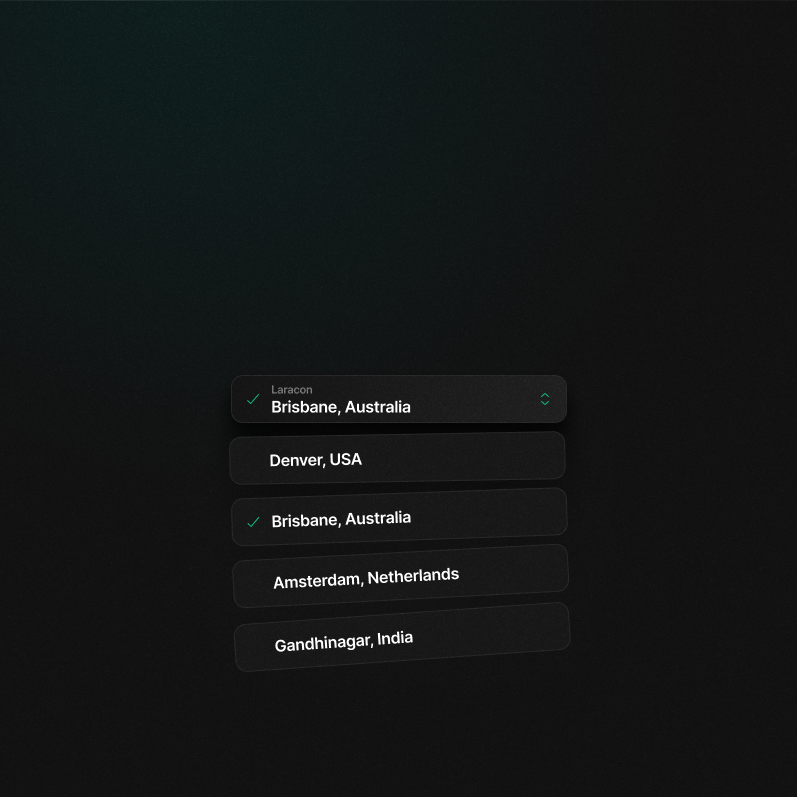

## Cool Dropdown

This is the implementation of the cool dropdown from the Laravel team.

Some notes:
- Uses Radix UI for the dropdown menu, Motion for the animations, and Tailwind for the styles.
- Everything is animated, but respects the user's reduced motion preference.
- It's fully accessible, with a live region for the selected location.
- Added some sound effects for funzies.

Some things I'd do if I had more time:
- Add light mode + toggle - make it respect system preference
- Add a sound toggle to turn off the sound effects